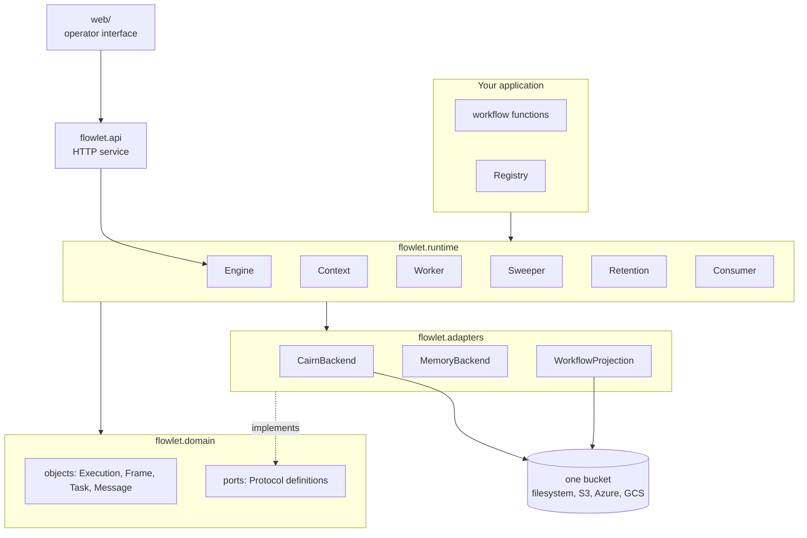
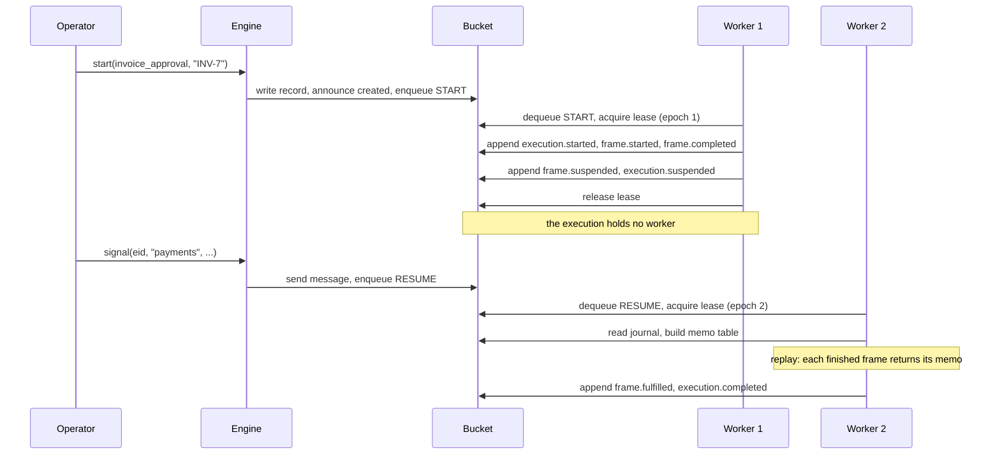
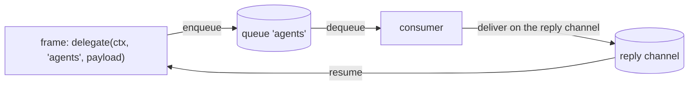

# Architecture

Flowlet is a library with four layers and five processes. This page explains
what each one owns, and where each guarantee comes from.

## The shape



## The layers

| Layer | Content | Rule |
|---|---|---|
| `flowlet.domain` | the objects, the errors, and the ports as `Protocol` definitions | pure. No I/O. It imports one thing from CairnDB: the `Timestamp` value type. |
| `flowlet.adapters` | the implementations of every port | one module per backend: `cairndb`, `memory`. |
| `flowlet.runtime` | `Engine`, `Context`, `Worker`, `Sweeper`, `Retention`, `Consumer` | the protocols of the specifications, step by step. |
| `flowlet.patterns` | `delegate`, `review`, `saga`, `fan_out`, `on_tick` | written against the `Context` API only. The engine does not know them. |
| `flowlet.api` | the HTTP service | holds no state: reads come from the projection, writes go through the engine. |
| `flowlet.cli` | the `flowlet` command | builds the backend and the engine, then runs one job. |

Three modules sit beside the layers: `flowlet.codec` renders objects to
JSON-compatible data and back, `flowlet.log` configures structlog, and
`flowlet.evidence` keeps the attempt log.

## The ports

The domain defines each primitive as a `Protocol`. Each port maps to exactly
one CairnDB construct.

| Port | Purpose | CairnDB construct |
|---|---|---|
| `Journal` | the trace and the memo of one execution | a named log |
| `ControlLog` | the lifecycle entries of all executions | the named log `wf` |
| `Ownership` | one owner per execution | a lease |
| `Dispatch` | an idempotent start | a claim, which is put-if-absent |
| `Queue` | the tasks | objects plus one lease per task |
| `Channel` | the messages | one log per channel, plus wait markers |
| `Timers` | the future resumes | objects listed by prefix |
| `ExecutionStore` | the `Execution` record | one object, put-if-absent and CAS |
| `Archive` | the folded finished executions | one object, put-if-absent |
| `Evidence` | the attempt logs and the attachments | objects listed by prefix |

`CairnBackend` implements all of them over one `CairnDB` instance.
`MemoryBackend` implements all of them in memory, for the tests.

```python
backend = CairnBackend.configure({"storage": {"type": "s3", "bucket": "my-bucket"}})
engine = Engine(backend.ports, Site.local("w-1"), registry=registry)
```

### The key layout

Every key of the engine starts with `wf/`. Every log starts with `wf`.

| Key or log | Content |
|---|---|
| `logs/wf/` | the control log |
| `logs/wf.exec.{eid}/` | the journal of one execution |
| `logs/wf.ch.{channel}/` | the messages of one channel |
| `wf/exec/{eid}/meta` | the execution record |
| `wf/exec/{eid}/lease` | the ownership lease |
| `wf/dispatch/{key}` | the winner of a dispatch key |
| `wf/queues/{queue}/…` | the tasks, their leases and their enqueue markers |
| `wf/waits/{channel}/{eid}` | a wait marker |
| `wf/timers/{timer_id}` | a timer |
| `wf/archive/{eid}.msgpack` | a folded execution |
| `wf/evidence/{eid}/…` | the attempt logs and the attachments |

One bucket is one tenant. There is no tenant field.

## The processes

| Process | Command | Needed when | How many |
|---|---|---|---|
| **worker** | `flowlet worker` | always | as many as the throughput asks for |
| **sweeper** | `flowlet sweeper` | always | one is enough; two do no harm |
| **retention** | `flowlet retention` | you keep the bucket small | one, as a cron job |
| **HTTP service** | `flowlet.api.create_app` | people or remote clients need access | two or more, behind a load balancer |
| **consumer** | `flowlet-runner`, or your own | a workflow delegates work outside the engine | one per pool of agents |

Each process reads the same bucket. No process talks to another process.

### The worker

The worker repeats one procedure: dequeue a task, acquire the lease of its
execution, build the memo table, replay the function, append what happened, and
release the lease. It renews the task lease and the execution lease while it
works. On `LeaseLost` it stops at once and does not ack the task.

### The sweeper

The sweeper has no lease. Each of its actions is idempotent, so two sweepers
can run at the same time. It:

1. fires the timers that are due,
2. enqueues a resume for each execution whose lease expired,
3. enqueues the `START` task again for a start that was lost,
4. repairs the control log when a worker crashed between two appends,
5. clears the wait markers that no frame waits for.

:::{admonition} Nothing in a bucket fires at a time by itself
:class: warning

A `ctx.sleep`, a receive timeout and a retry delay all need the sweeper. An
installation without a sweeper never wakes a suspended execution.
:::

### The HTTP service

The service puts the engine on a network. It holds no state of its own: every
read comes from the projection or from a port, and every write goes through the
engine. The actor of a write comes from the access token, never from the body.

It serves three planes:

| Plane | For | Content |
|---|---|---|
| catalog | the interface | the workflows of this process and their argument schemas |
| control | operators, the interface | executions, journals, frames, reviews, queues |
| worker | a consumer that cannot reach the bucket | dequeue, renew, ack, nack, deliver |

## The life of an execution



The worker that finishes an execution is rarely the worker that started it.
Nothing in the process holds the state of an execution between two tasks.

## Where each guarantee comes from

| Guarantee | Source |
|---|---|
| A journal entry is durable and ordered when the append returns. | the log append of CairnDB |
| The memo of a frame never changes once it is written. | the memo rule, plus the immutability of a log |
| One worker owns one execution at a time. | the lease |
| A fenced worker gets `LeaseLost` at its next renewal. | the lease epoch, plus CAS |
| One task is dequeued by one worker at a time. | a lease on the task key |
| Two starts with one dispatch key produce one execution. | the claim |
| One channel has a total order of messages. | one log per channel |

Not guaranteed:

- the order between two channels,
- the order between the journal and the control log,
- exactly-once external effects of a step.

The last one is the rule you design around: **a step must be idempotent.**

## The boundary of a delegate

A `DELEGATE` task leaves the engine. The consumer is a process that you own:
an agent runner, a service, or a group of people behind a form.



Rules of that boundary:

- A consumer never appends to a journal, and never writes an execution record.
  Its only writes are the reply message, the evidence, and the state of its own
  task lease.
- A consumer answers one time per task. The receive frame consumes the first
  message only.
- The consumer delivers first and acks second. The reverse order can lose the
  answer.
- A consumer that reaches the bucket uses the ports. A consumer that cannot
  uses the HTTP worker plane, which is the same protocol with one more hop.

{py:obj}`flowlet.runtime.Consumer` implements that loop,
minus the work. The work is a `Handler` that you write.

## What you can replace

| You want | You write |
|---|---|
| another storage backend | an object with the ten ports. `MemoryBackend` is the reference. |
| another pattern | a function that takes a `Context`. The engine needs no change. |
| another consumer | a `Handler` for `Consumer`, or your own loop over the `Queue` port. |
| another interface | an HTTP client of the control plane. The web application is one. |
| another identity provider | an `Authenticator`. `OIDCAuthenticator` is the reference. |

## What the engine does not do

- It does not run a server, a scheduler daemon, or a broker.
- It does not check that a step is idempotent.
- It does not check what an actor is permitted to do. The HTTP service does.
- It does not know about reviews, agents, boards or gates. Patterns and
  applications build those on the `Context` API.
- It has no way to continue an execution as a fresh one, so a journal grows for
  as long as the execution lives. Anything endless is a process, not a
  workflow.
