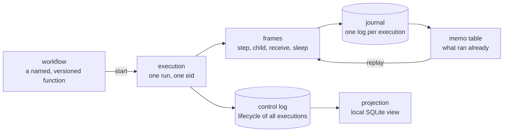
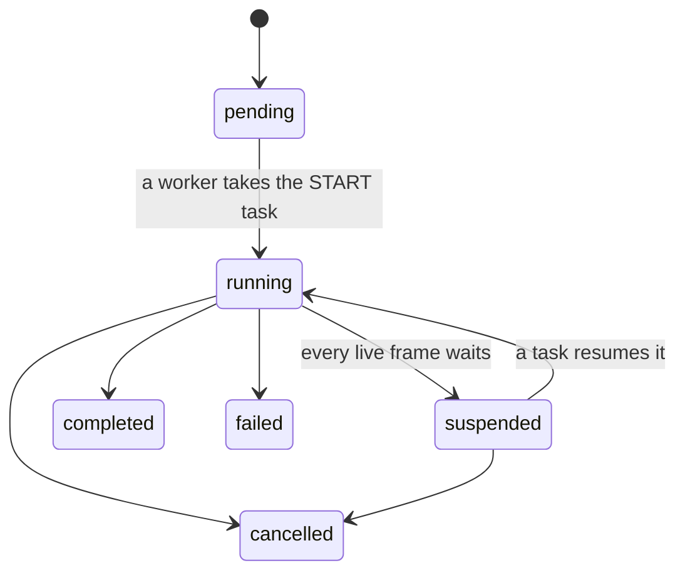

# Concepts

This page explains the words that the code, the CLI and the interface use. One
word names one concept. The [glossary](#the-words-and-their-meanings) at the
end lists all of them.

## The model in one picture



## Workflow and execution

A **workflow** is a definition: a named, versioned `async` function. An
**execution** is one run of that workflow. It has an id, the `eid`.

```python
@registry.workflow("invoice_approval", version="3")
async def invoice_approval(ctx: Context, invoice_id: str) -> str: ...
```

Two versions of one name can live at the same time. Each execution remembers
the version it started with, so new code does not disturb a live run.

An execution has six statuses:



`completed`, `failed` and `cancelled` are terminal. No transition leaves them.

An `eid` is a UUID. A started execution gets a UUIDv7, so the ids sort by
creation time. A child execution gets a UUIDv5 of its parent frame, so the id
is deterministic and the start of a child is idempotent.

## Frame

A **frame** is one node of the execution stack. Each `Context` method creates
one frame. There are five kinds:

| Kind | Method | What it does |
|---|---|---|
| `root` | — | the workflow function itself |
| `step` | `ctx.step` | runs a function one time, and memoizes the value |
| `child` | `ctx.child` | starts a child execution and waits for it |
| `receive` | `ctx.receive` | waits for a message on a channel |
| `sleep` | `ctx.sleep`, `ctx.sleep_until` | waits until an instant |

A **frame id** (`fid`) is a path. The root frame is `root`. A frame under `P`
with the name `N` is:

- `P/N#n` when you give no key. `n` counts the frames with that name under `P`.
- `P/N:key` when you give `key`.

```python
await ctx.step(fetch, 1)                 # root/fetch#0
await ctx.step(fetch, 2)                 # root/fetch#1
await ctx.step(fetch, 3, key="orders")   # root/fetch:orders
```

The id does not depend on the clock, on the worker, or on the order in which
concurrent frames complete. The engine assigns `n` at the moment you call the
method, so `ctx.gather` gives stable ids.

:::{admonition} Give a key to a frame in a loop
:class: tip

A key makes a frame id legible and stable. `key=str(i)` in a loop, or
`key=order_id` for one order. The engine raises `DuplicateFrameError` when
one key repeats under one parent.
:::

## Step

A **step** is the unit of effect. It runs one time for the life of the
execution.

```python
invoice = await ctx.step(fetch_invoice, invoice_id)
```

The engine appends `frame.started`, runs the function, and appends
`frame.completed` with the value. The value must be JSON-compatible.

`ctx.now()`, `ctx.random()` and `ctx.uuid()` are steps too. Use them instead of
the clock, the random module and `uuid4`, or a replay gives a different answer
than the first run.

Four more methods are steps with an effect of their own:

| Method | Effect | Memo |
|---|---|---|
| `ctx.send` | one message on a channel | the message sequence |
| `ctx.announce` | one entry on the control log | the control-log sequence |
| `ctx.enqueue` | one task on a queue | the task id |
| `ctx.withdraw` | removes a task from a queue | whether a task was removed |

## Memo and replay

The **memo** of a frame is the value of the first `frame.completed` entry for
that frame id. To resume an execution, a worker:

1. reads the journal and builds the memo table,
2. runs the workflow function again from the first line,
3. returns the memo of each frame that completed already,
4. runs the first frame with no memo.

The engine runs a memoized frame zero times. It runs the function itself many
times. This is why the function must be deterministic.

:::{admonition} What breaks a replay
:class: danger

A workflow function that reads `datetime.now()`, `random`, an environment
variable, or a database outside a step. A function that changes its
arguments. A branch on a value that the journal does not hold.
:::

**First outcome wins.** A later `frame.completed` entry for one frame id is
ignored. Two workers can therefore run one frame at the same time without
corruption of the execution. The effect of a step can still happen twice, so a
step must be idempotent for its external effect. The engine does not check
this.

When the code of a live execution changes, a replay finds a frame id with a
different argument digest and raises `NondeterminismError`. The execution
suspends and waits for an operator. The operator cancels it, or points it at
another version with `flowli migrate`.

## Attempt, failure and retry

An **attempt** is one real run of a frame by one worker. The first attempt is
number 1. A new attempt is `1 + the count of failed attempts`.

```python
from flowli.domain import RetryPolicy

await ctx.step(call_bank, payment,
               retry=RetryPolicy(max_attempts=5, backoff=timedelta(seconds=2),
                                 backoff_factor=2.0, max_backoff=timedelta(minutes=5)))
```

| Field | Meaning |
|---|---|
| `max_attempts` | `1` means no retry |
| `backoff` | the delay before attempt 2 |
| `backoff_factor` | multiplies the delay at each attempt |
| `max_backoff` | the ceiling of the delay |

A retry with a delay suspends the frame on a timer. The execution releases its
worker while it waits. Raise `NonRetryableError` in a step to stop the retries
at once. When no attempt is left, the engine raises `StepFailed` in the
workflow function, and raises it again on every replay.

## Waits

An execution that waits holds no worker, no thread and no connection. A worker
appends `execution.suspended`, releases the lease, and takes other work.

| You write | The frame waits for | What resumes it |
|---|---|---|
| `await ctx.receive("payments")` | a message on a channel | `engine.signal`, or `flowli signal` |
| `await ctx.sleep(timedelta(days=1))` | an instant | the sweeper |
| `await ctx.child(other_workflow, x)` | a child execution | the child, when it ends |
| a retry with a delay | an instant | the sweeper |

`ctx.gather` runs frames at the same time. The execution suspends only when
every frame of the gather waits.

```python
results = await ctx.gather(ctx.step(a), ctx.step(b), ctx.receive("x"))
```

## Channel and message

A **channel** is a named, ordered stream of messages. A **message** is one item
on it, with a sequence number, a payload and its provenance.

- `scope="execution"`, the default, reads and writes `{eid}.{channel}`.
- `scope="global"` reads and writes the name as you give it.

`engine.signal(eid, channel, payload, by=...)` sends one message and puts a
`RESUME` task on the queue. `engine.broadcast(channel, payload, by=...)` sends
one message on a global channel and resumes every waiter of it.

A receive frame consumes the first message with a sequence higher than the last
one this execution consumed on that channel. A second message with the same
payload is therefore harmless.

## Task and queue

A **task** is a unit of work on a **queue**. A worker dequeues tasks.

| Kind | Meaning |
|---|---|
| `START` | run the root frame of a new execution |
| `RESUME` | run a suspended execution |
| `RUN_STEP` | run one step frame in another worker pool |
| `DELEGATE` | consumed outside the engine: people, an agent, a service |

A task id is derived from the kind, the execution and a key. A second enqueue
with the same id is a no-op, so an enqueue is idempotent. A worker never runs a
`DELEGATE` task: it returns the task to the queue.

An expired task lease makes a task visible again. Delivery is therefore
at-least-once.

## Ownership: lease and epoch

One worker owns one execution at a time. It holds a **lease**. The lease has an
**epoch**, which increases at each acquisition. Every write of the worker
carries that epoch in its provenance.

A worker renews the lease while it works. When another worker steals an expired
lease, the first worker gets `LeaseLost` at its next renewal. It stops at once
and writes nothing more.

:::{admonition} Why a paused worker cannot corrupt an execution
:class: note

A paused worker can complete a frame after another worker stole the lease.
That entry stays in the journal, and its epoch is visible. The memo rule
takes the first completed entry, so the two workers converge on one value.
:::

## Cancel

`engine.cancel(eid, by=...)` writes a cancel request in the lease state and
puts a `RESUME` task on the queue. It does not kill anything.

- A running worker reads the request at its next frame boundary. It raises
  `Cancelled` in the workflow function, appends `execution.cancelled`, and
  releases the lease.
- A suspended execution is cancelled by the worker that resumes it.

A `DELEGATE` task has a consumer outside the engine. The engine does not reach
that consumer. The HTTP service propagates the cancel to the task, because the
projection holds the pair of the task and its queue.

## Provenance

Every entry, task and message carries one **provenance** value. It answers four
questions.

| Question | Field | Content |
|---|---|---|
| who | `actor` | `worker`, `human`, `system` or `schedule`, plus an id |
| where | `site` | host, pid, worker id, instance, region, lease epoch |
| what | `code` | workflow, version, frame kind, frame name, code reference |
| when | `at` | a UTC instant |

The id of a human actor is the email address. That keeps a journal legible
years later. `on_behalf_of` names the person when a system acts for them.

## The journal, the control log, the projection

Three stores, and each one answers a different question.

| Store | Holds | Answers |
|---|---|---|
| **journal** | every frame entry of one execution | what happened inside this execution |
| **control log** | the lifecycle entries of all executions | which executions exist, and where they are |
| **projection** | a local SQLite view of the control log | the dashboards, the lists, the review inbox |

The journal is the authority. The control log is coarse: it never sees a frame
entry. The projection is derived state; application code never writes to it.
The sweeper repairs the control log when a worker crashes between the two
appends.

## Evidence

**Evidence** is what a step wrote while it ran: the attempt log, and the
attachments. It explains the journal. It is never authority, and no decision
depends on it.

```python
from flowli.log import get_logger

log = get_logger("myapp")


def fetch_invoice(invoice_id: str) -> dict:
    log.info("fetched", invoice=invoice_id, rows=3)
    return ...
```

`eid`, `fid` and `attempt` are bound to the event already. You write the name of
the event and the fields that matter.

The key of evidence is the attempt, not the frame. A retry writes a second log.
A replay writes nothing, because a frame with a memo does not run. A write of
evidence is best effort: a frame never fails because a log did not write.

## Patterns

A **pattern** is a function written against the `Context` API only. The engine
does not know it. They live in `flowli.patterns`.

| Pattern | What it does |
|---|---|
| {py:obj}`delegate <flowli.patterns.delegate>` | puts a task on a queue, waits for the answer on a channel |
| {py:obj}`review <flowli.patterns.review>` | a delegate to a human queue, plus the announcements of the inbox |
| {py:obj}`saga <flowli.patterns.saga>` | runs actions in order, undoes the completed ones in reverse on a failure |
| {py:obj}`fan_out <flowli.patterns.fan_out>` | one child execution per item, in item order |
| {py:obj}`on_tick <flowli.patterns.on_tick>` | one execution per tick of a schedule, exactly once |

Write your own the same way. A pattern needs no support from the engine.

## Retention and archive

A scheduled job folds each execution that finished more than 30 days ago. It
writes one archive object with the record, the journal and the scoped channels,
then deletes the live state. `engine.journal(eid)` reads the archive when the
live journal is gone.

The archive does not hold the evidence. Copy an attempt log out of the bucket
before the delay expires when you must keep it for longer.

## The words and their meanings

| Word | Meaning |
|---|---|
| **workflow** | A named, versioned coroutine function. A definition, not a run. |
| **execution** | One run of a workflow. Identified by an `eid`. |
| **frame** | One node of the execution stack: a step, a child, a receive, a sleep, or the root. |
| **frame id** (`fid`) | The deterministic path of a frame inside its execution. |
| **attempt** | One real run of a frame by one worker. |
| **outcome** | The result of an attempt: completed with a value, or failed with an error. |
| **memo** | The first completed outcome of a frame in the journal. |
| **journal** | The log of one execution. Holds every frame entry. |
| **control log** | The shared log `wf`. Holds the lifecycle entries only. |
| **entry** | One event in the journal or in the control log. |
| **lease** | What gives one worker the ownership of one execution. |
| **epoch** | The fence token of a lease. It increases at each acquisition. |
| **task** | A unit of work on a queue: start, resume, run a step, or delegate. |
| **queue** | A named set of tasks. Workers dequeue from it. |
| **channel** | A named, ordered stream of messages. |
| **message** | One item sent on a channel. |
| **timer** | A future instant at which the sweeper resumes an execution. |
| **worker** | A process that dequeues tasks and runs executions. |
| **sweeper** | A scheduled job that fires timers and recovers dead executions. |
| **actor** | Who acts: a worker, a human, a system, or a schedule. |
| **site** | Where the code runs: host, process, instance, region, worker, epoch. |
| **code** | What runs: workflow name, version, frame kind, frame name, code reference. |
| **provenance** | Actor, site, code, attempt number and time, together. |
| **suspended** | A frame waits for a condition. Or, an execution has no owner. |
| **resumed** | A worker acquired the lease of a suspended execution. |
| **announce** | Append an entry to the control log. |
| **claim** | The put-if-absent primitive. Exactly one caller wins. |
| **evidence** | What a step or an agent wrote while it ran. It explains the journal. |
| **capability** | One permitted operation of the HTTP service. |
| **consumer** | A process outside the engine that takes a delegate task and answers it. |

### The verbs

One action has one verb. These documents and the code use no synonym for them.

| Action | Verb | Do not use |
|---|---|---|
| Add an entry to a log | append | write, record, log, emit |
| Store an object | write | save, persist, record |
| Get data | read | fetch, load, retrieve |
| Take a lease | acquire | claim, lock, take |
| Extend a lease | renew | heartbeat, refresh |
| End a lease | release | free, unlock |
| Add a task | enqueue | push, submit, schedule |
| Take a task | dequeue | pull, pop, poll |
| Finish a task | ack | complete, delete |
| Return a task | nack | requeue, retry |
| Put a message on a channel | send | publish, emit, signal |
| Take a message from a channel | receive | consume, read, wait |
| Test a condition | check | verify, validate, confirm |
| Execute a function | run | invoke, execute, call |
