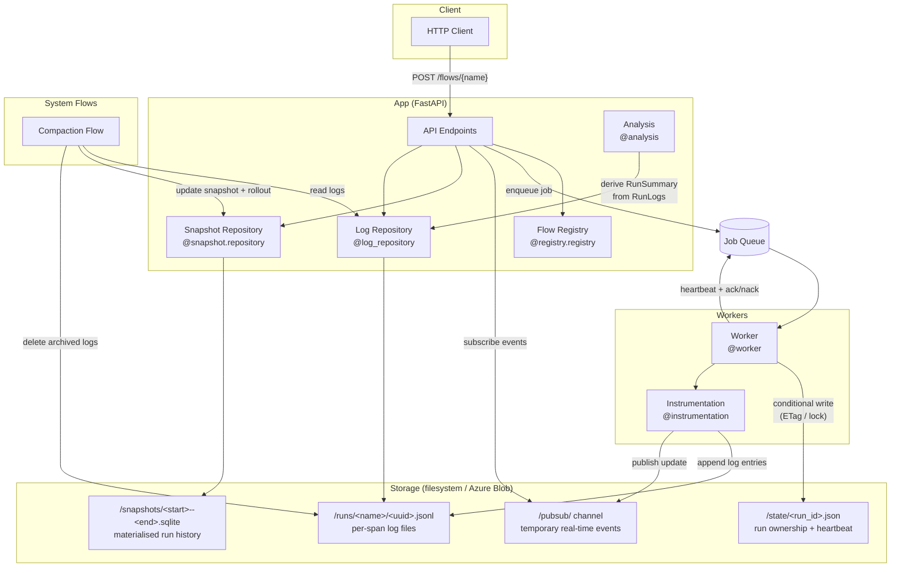
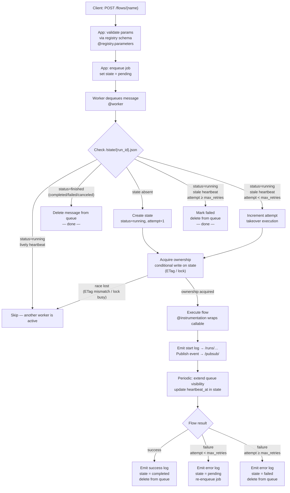

# Flowlet Architecture

## Overview

Flowlet is a pure python lightweight embeddable task/workflow orchestration framework.
It aims at having minimal deployment requirements compatible with serverless cloud services.
This makes flowlet highly cost effective for small to medium workloads.

### What flowlet is *NOT*
Flowlet does not aim at being a highly scalable centralised entreprise-wide solution.
For that case, use one of the many already existing feature-packed frameworks.

## Components

### Flow
- A flow registry contains all flow code and is embedded in the app.
- The app exposes for each flow an HTTP endpoints to submit it to workers.
- Jobs are submitted to the Job Queue.
- Workers pick up a job and execute its flow.
- During execution, workers emits logs to storage.
- There are 2 logs channels: 1 for all logs (/logs) which are for storage purpose, and 1 for flow logs only (/pubsub) which serve as temporary pubsub persistence layer.
- Flow logs are related to flow execution and the status (pending, running, retry, failed, completed, canceled) is derived.
- On flow log event, publish update message to pubsub.
- On schedule, put a special system flow called compaction.
- Compaction aggregates flow logs for finished runs (completed, failed, canceled) into run stats stored in sqlite snapshots, and deletes the flow logs (they are read-only at that point and exist for archiving in all logs storage).
- The app serves an API using FastAPI app.
- The api server on startup loads the active snapshot locally, and updates it with flow logs.
The api server subscribes to pubsub and fetches new flow logs when events are published.

### Memory management
- Use custom id generator including timestamp similar to uuidv7, but ordered most recent first. This helps listing on blob storage, which is lexicographically ordered.
- Snapshots are rolled-out according to a strategy, keeping a single active snapshot and possibly many archived older snapshots. For example, roll-out based on count and/or time thresholds (sort of like log-merge-trees).

### Workers concurrency 

Workers orchestrate via the queue and state storage locks.
If flows are idempotent (strongly recommended), then concurrency is safely handled.
Queue is used for triggers and retry management (heartbeat, avoid premature duplicate runs).
In storage, /state/{run\_id}.json stores the run's current state atomically using locks.

Example queue message:
{
  "job\_id": "123",
  "run\_id": null,
  "submitted\_at: "2026-02-12T10:12:23Z"
  "payload": { ... }
}

Example state content:

{
  "run\_id": "feabd123-adc",
  "status": "Running",
  "worker\_id": "revision+container-id",
  "started\_at": "2026-02-27T09:58:00Z",
  "heartbeat\_at": "2026-02-27T10:00:00Z"
  "attempt": 1,
  "max\_retries": 3
}

1. Jobs are submitted to the queue and modify state to pending.
2. Worker dequeues the message, checks status:

     - if state does not exist -> create it with running, attempt = 1, ...
     - if status is finished (completed/failed/canceled) -> delete message from queue.
     - if status is running, and lively heartbeat -> skip.
     - if status is running, and stale heartbeat and attempt >= max_retries -> mark as failed and delete job from queue.
     - if status is running, and stale heartbeat and attempt < max_retries -> increment attempt and takeover execution.

   This guarantees effective at-most-once execution even with crashes or slow jobs.
3. Worker sets short visibility timeout on queue (e.g., 5 minutes). While processing,
   periodically extend visibility and update heartbeat\_at in state.
   Liveliness prevents another worker from picking up the job prematurely.
4. Job completes: if successful, update status to completed and delete job from queue.
   If fails and attempt < max\_retries, update status to pending and put job back on queue.
   If fails and attempt >= max\_retries, update status to failed and delete job from queue.
5. Worker crashes: visibility timeout expires, job picked up by another worker (goto 2)


### Concurrency Control Summary

- Optimistic concurrent writes to state prevent two workers from simultaneously marking the blob Running.
- Heartbeat timestamps detect stale executions → allow safe takeover.
- Queue visibility timeout prevents premature duplicate processing.
- Idempotent job flows ensure safe reprocessing if takeover occurs.
- Storage logs are timestamped events, so append-only -> support concurrent read and write.
- PubSub is used for real-time syncing only and does not need to preserve order. No data is passed by pubsub, data always is stored in storage.

## Diagrams

### Components

TODO : components graphic is terribly bad.


### Task / Flow Execution



## Cloud Deployments

### Storage
Use append blobs for log files, and blobs with ETags for runs' state.
ETags give optimistic concurrency: no-long held locks, and any number of
readers can proceed without blocking.

Every state write response includes an `ETag` (an opaque version tag).
The conditional state writes are delegated to the
[ChroniQL](https://github.com/Quadratic-Labs/chroniql) object store
(`chroniql.storage.BlobStorage.put_object_sync(..., if_match=etag)`), which
implements the `If-Match` compare-and-swap uniformly for Azure, S3, and GCS —
`StateRepository` receives the store via its `object_store` attribute, wired
by `FlowletConfig.object_store`. The protocol:

1. Worker reads the current state blob → receives the blob's current ETag.
2. Worker prepares the updated state and issues a `PUT` with
   `If-Match: <current-etag>`.
3. Azure atomically checks: if the blob's ETag still matches, it applies the
   write and returns a new ETag; otherwise it rejects the request with
   `HTTP 412 Precondition Failed`.
4. The losing worker catches the 412, re-reads the blob, and decides whether
   to retry or yield (goto step 2 of the worker concurrency protocol).

### Queue and PubSub
Use storage queue for the Job Queue: it includes visibility timeouts to
handle retries nicely.
Use PubSub for PubSub as is. We require only QoS 0 (quality of service), i.e.
fire and forget.

### Run History (optional)

Archived runs are immutable facts, so long-horizon run queries are served by
an event-sourced projection instead of rescanning state files. With
`history: true` in `FlowletConfig`:

- The sweeper durably appends one `run.archived` event per archive candidate
  to a dedicated ChroniQL log under `<storage root>/history/` — *before*
  removing any state file. If the append fails, archiving is skipped for the
  pass and retried on the next sweep.
- Readers call `flowlet.history.refresh_history_db(store, db_path)` to
  incrementally project the log into a durable SQLite `runs` table
  (idempotent `INSERT OR REPLACE` by `run_id`, so re-recorded runs are
  harmless). The projection file is a disposable cache, fully rebuildable
  from the log.

The live control plane is untouched: leases, the worker state machine, and
the pull-based cache never depend on the history log.

## Local Deployments
Local deployments are simple, and are a good fit for development and testing.

### Storage
TODO : locks discussion is too low-level. Will need to document this better.

Use dedicated directories for logs and runs' state. Concerning locks:

State files (`/state/<run_id>.json`) must be written atomically so that exactly
one worker can acquire ownership of a run at a time.  The mechanism differs by
backend.

#### Local Filesystem — Atomic Lock Files

POSIX filesystems have no ETag equivalent, but offer two complementary
primitives:

**1. Atomic exclusive file creation (`O_CREAT | O_EXCL`)**

```python
import os

lock_path = state_path.with_suffix(".lock")
try:
    fd = os.open(lock_path, os.O_CREAT | os.O_EXCL | os.O_WRONLY)
    os.close(fd)
    # — lock acquired: read-modify-write state file —
    lock_path.unlink()           # release
except FileExistsError:
    pass                         # lock held by another worker — skip
```

`O_CREAT | O_EXCL` is guaranteed atomic on any local POSIX filesystem: at most
one process will succeed in creating the file.  This closely mirrors the ETag
"first writer wins" semantic.

**2. `fcntl.flock` — advisory exclusive lock**

```python
import fcntl

with open(state_path, "r+") as fh:
    try:
        fcntl.flock(fh, fcntl.LOCK_EX | fcntl.LOCK_NB)
        # — modify state —
        fh.seek(0); fh.write(json.dumps(state)); fh.truncate()
    except BlockingIOError:
        pass                     # lock held — skip
    finally:
        fcntl.flock(fh, fcntl.LOCK_UN)
```

`LOCK_NB` makes the call non-blocking (mirrors the "fail-fast" behaviour of a
412).  Note that `flock` is advisory and does **not** work across NFS mounts,
which makes it unsuitable for shared network filesystems.

#### Summary

| Property               | Azure Blob (ETag)         | Local FS (lock file / flock)     |
|------------------------|---------------------------|----------------------------------|
| Atomicity guarantee    | Server-side CAS           | Kernel-level (`O_EXCL` / flock)  |
| Works across machines  | Yes (shared storage)      | No — single-host only            |
| NFS safe               | N/A                       | `flock`: no; `O_EXCL`: yes       |
| Stale-lock risk        | None (no persistent lock) | `O_EXCL`: yes if process crashes — add TTL check; `flock`: auto-released on process exit |
| Semantic match to ETag | High — both optimistic    | `O_EXCL` ≈ ETag; `flock` ≈ mutex |

For local development, the **atomic lock-file approach (`O_CREAT | O_EXCL`)**
is preferred: it is the closest functional equivalent to Azure's ETag
conditional writes, and it degrades safely across all local POSIX filesystems.
A crashed worker's stale lock file can be detected by embedding a TTL or PID in
the file and reclaiming it after the heartbeat deadline passes — exactly the
same logic used for state takeover.

## Design Philosophy

Flowlet follows these principles:

1. **Simplicity**: Minimal orchestration focused on logging and observability
2. **Separation of Concerns**: Each component has one responsibility
3. **Flexibility**: Pluggable storage backends via handlers
4. **Standard Python**: Built on Python logging for compatibility
5. **No Magic**: Explicit dependency injection, clear data flow
6. **Thread-Safe**: Safe for concurrent and async execution

## Future Enhancements

Potential future additions (not currently implemented):

1. **Async Executor**: `ExecutorAsync` for native async support
2. **Remote Executors**: Execute flows on remote workers (Azure Jobs, etc.)
3. **Memoization**: Cache task results
4. **Retries**: Automatic retry on failure
5. **Webhooks**: Trigger flows via webhooks
6. **Real-time Dashboard**: Live execution monitoring
7. **Access Policies**: Fine-grained permissions
