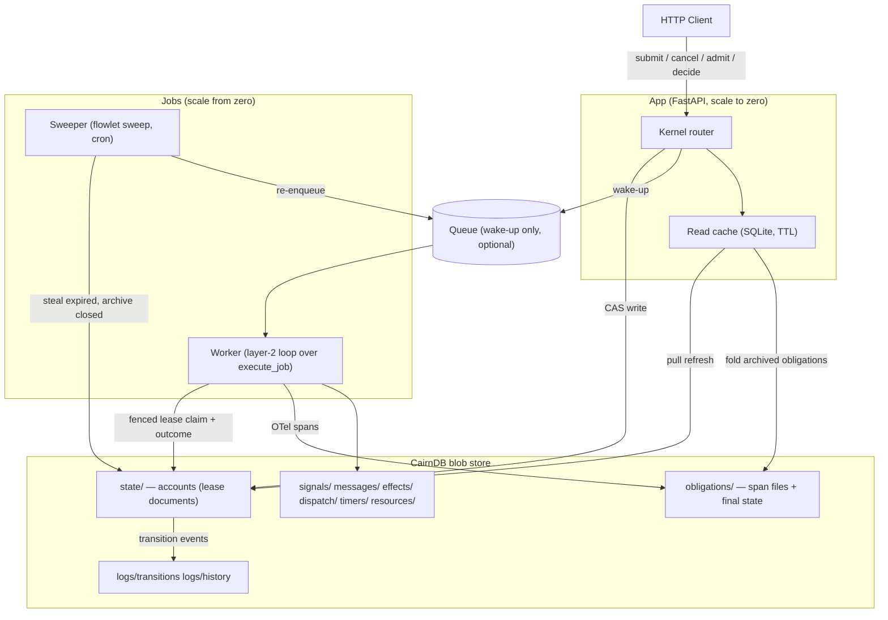
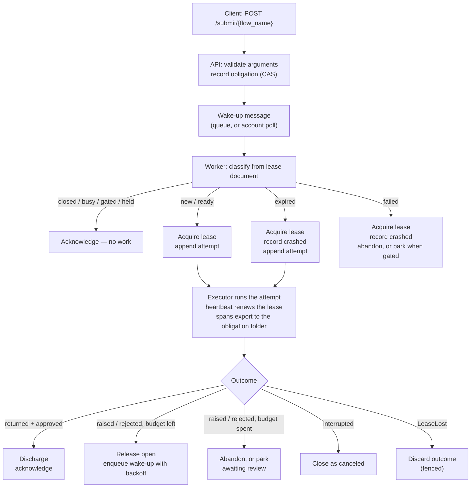

Flowlet Architecture
====================

Overview
--------

Flowlet is a pure-Python, lightweight, embeddable orchestration kernel.
It has minimal deployment requirements, and it fits serverless cloud services.
Every component scales to zero.
Storage costs dominate the monthly bill for small and medium workloads.

Refer to [design.md](design.md) for the account model: obligations, attempts,
reviews, effects, and consumptions.
This document describes the components, the storage layout, the concurrency
rules, and the deployments.

### What Flowlet is not

Flowlet is not a highly scalable, centralized, enterprise-wide solution.
Use one of the many feature-packed frameworks for that case.

Storage layout
--------------

One CairnDB blob store holds everything.
Flowlet defines no storage backend of its own: the filesystem, S3, Azure, and
GCS come from CairnDB verbatim.

| Prefix | Content |
|---|---|
| `state/<flow_name>/<obligation_id>.json` | The account of one obligation, carried as a lease document. Active obligations only. |
| `obligations/<flow_name>/<yyyy-mm-dd>/<obligation_id>/` | The durable record of one obligation: `spans-<attempt>.jsonl` and the final `state.json`. |
| `signals/<flow_name>/<obligation_id>/<name>.json` | Signal latches. `cancel` is the first signal. |
| `messages/<flow_name>/<obligation_id>/<topic>/<uuid7>.json` | Ordered message channels, one object per message. |
| `effects/<flow_name>/<obligation_id>/<sha256>.json` | Effect claims — the exactly-once guarantee. |
| `dispatch/<flow_name>/<sha256(key)>.json` | Dispatch-key mapping for idempotent submissions. |
| `timers/<flow_name>/<obligation_id>/<name>.json` | Durable timer documents. |
| `resources/<sha256(name)>.json` | Generic resource leases. |
| `logs/transitions/` | The account-transition feed (a CairnDB named log). |
| `logs/history/` | The obligation-history log (optional, a CairnDB named log). |

Two rules shape this layout:

- The active state directory stays small.
  The sweeper archives closed obligations into their obligation folder.
  Sweep cost and cache cost thus never grow with history.
- One obligation folder is self-contained.
  The `uuid7` timestamp of the obligation id gives the date partition, so a late
  retry lands in the same folder.

Components
----------

### API

The API is a FastAPI router mounted by the host application.
It serves the kernel's account surface:

- `POST /submit/{flow_name}` — validate the arguments, record the obligation,
  and send a wake-up.
- `POST /obligations/{obligation_id}/cancel` — set the cancel signal.
- `POST /obligations/{obligation_id}/review` — record an authorized review, with an
  optional budget extension.
- `POST /obligations/{obligation_id}/admit` — release a held obligation (fenced).
- `POST /obligations/{obligation_id}/claim`, `/renew`, `/outcome`, `/effects`, `/recv` —
  the fenced claim surface for external executors.
- `POST /obligations/{obligation_id}/messages/{topic}` — send a message to an obligation.
- `POST /obligations/query`, `/logs/query`, `GET /obligations/{obligation_id}`,
  `GET /obligations/{obligation_id}/events` — read projections.
- `GET /transitions` — the ordered transition feed, with a cursor.

Authoring endpoints (synchronous execution, schema introspection) belong to
layer-2 controllers, which mount their routes beside this router.

### Queue

The queue is a wake-up channel only.
It holds no retry state, no ownership, and no payload of record.
A worker acknowledges each message as soon as the obligation's state is resolved.
Duplicate deliveries are harmless: the worker state machine drops them.

The queue is optional.
With `queue: {"type": "account"}`, submissions are recorded directly as
obligations, and workers poll the active state directory.
The trade is dispatch latency for one less service.

### Worker

A worker turns one wake-up message into at most one attempt.
It classifies the obligation from its lease document:

| State | Condition | Action |
|---|---|---|
| `new` | No document exists | Acquire, append attempt 1, execute |
| `closed` | Obligation discharged or abandoned | Acknowledge, done |
| `busy` | Lease held and not expired | Acknowledge — another worker owns it |
| `expired` | In-flight attempt, lease expired, budget left | Acquire, record `crashed`, append a new attempt, execute |
| `failed` | In-flight attempt, lease expired, budget spent | Acquire, record `crashed`, abandon (or park when gated) |
| `ready` | Open obligation, released after a failure | Acquire, append a new attempt, execute |
| `gated` | Awaiting review | Acknowledge — a review must arrive first |
| `held` | Admission not released | Acknowledge — an admission must arrive first |

The classification is advisory.
The acquisition re-derives the transition under compare-and-swap, so races
resolve correctly.

On a failure with budget left, the worker releases the lease and enqueues a
fresh wake-up with exponential backoff.
The backoff comes from the account, so every wake-up channel applies the same
window.

### Executor

The executor is the seam between the kernel and the work:

- Taskflow's executor invokes a decorated Python callable in process.
- CodeFlow's harness fills the same role over the HTTP claim surface.

The kernel interprets the end of the work:

- A normal return gives the outcome `returned`.
- A `ObligationCancelled` exception gives the outcome `interrupted`.
- A `LeaseLost` exception discards the outcome — the lease was fenced.
- Any other exception gives the outcome `raised`.

### Sweeper

The sweeper runs on a cron cadence and needs no long-lived process.
Each sweep lists the active state directory and:

1. Steals expired leases and records the dead attempt as `crashed`.
2. Re-enqueues stuck open obligations whose wake-up message was lost.
3. Fires due timers.
4. Archives closed obligations into their obligation folder, and clears their
   signals.

Sweeps are idempotent and overlap-safe.
Ownership moves only through the fenced lease acquisition, never through the
act of sweeping.
Failure-detection latency is the lease deadline plus the sweep interval.
Shorten the attempt's lease duration for faster takeover, not the sweep cadence.

### Tracer

Flowlet spans are ordinary OpenTelemetry spans.
The `BlobSpanExporter` writes finished spans as JSON lines into the obligation
folder; this file is the durable record the API reads back.
Standard OTLP exporters can be attached in addition; they are never the
source of truth.

The obligation id (uuid7) is the OpenTelemetry trace id — both are 128 bits.
Spans export on completion, so they give no in-flight visibility.
The lease document is the source of truth for liveness.

### Kernel primitives

The kernel offers a small set of durable primitives, all built on CairnDB
claims (put-if-absent) and leases:

- **Signals** are single-shot latches, out-of-band from the lease document.
  Duplicate senders converge on the first payload.
- **Messages** are ordered streams per topic.
  The uuid7 object name gives send order with no index.
  The consumption cursor lives in the account, under the lease fence, so a
  retried attempt replays its consumptions deterministically.
- **Effects** are exactly-once side-effect claims.
  Execution is at-least-once; recording is exactly-once.
  A loser reads back the winner's result and continues on the identical path.
- **Dispatch keys** collapse duplicate submissions.
  Exactly one submission wins the claim; later submissions converge on the
  same obligation id.
- **Timers** are swept documents.
  Nothing in the engine fires at time T; the sweeper fires due timers, and
  firing is idempotent.
- **Resource leases** give fenced ownership over arbitrary names — a write
  scope, a merge-queue lock, a shared fixture.

### Read cache

The API refreshes a local SQLite cache from storage on demand, with a short
TTL (default 5 s).
Per refresh it re-reads the small active directory in full, and it folds in
newly archived obligations exactly once.
The cache has no correctness role: drop it, and it rebuilds from storage.
This property makes the API scale-to-zero safe.

Concurrency control
-------------------

All conditional writes go through CairnDB's compare-and-swap
(`put_object_sync(..., if_match=etag)`).
CairnDB implements it uniformly for the local filesystem, Azure, S3, and GCS,
so local and cloud deployments share one protocol:

1. Read the current document; receive its ETag.
2. Write the update with `If-Match: <etag>`.
3. On mismatch, the store rejects the write (HTTP 412).
4. The loser re-reads and decides: retry or yield.

On top of compare-and-swap, the lease adds fencing:

- The lease document has exactly one writer — its holder.
  Cancellation travels out-of-band as a signal object.
- Every write after a claim is epoch-fenced.
  A worker whose lease was stolen gets `LeaseLost` and discards its outcome.
- The claim transition is atomic: crash accounting for a dead predecessor and
  the new attempt land in one write.

The remaining guarantees are idempotence by construction:

- Duplicate wake-up messages are dropped by the worker state machine.
- Duplicate signal sends, effect executions, and submissions converge on the
  first claim.
- Span files are append-only, one file per attempt, so takeover never gives
  two writers on one file.

Diagrams
--------

### Components

### Execution

Deployments
-----------

### Cloud

- The app and the sweeper run from one container image:
  `flowlet api` and `flowlet sweep`.
- The layer-2 surface starts the workers: it supplies the executor and drives
  `execute_job` per wake-up.
- The sweeper is a cron job (for example, a Container Apps job).
- The queue is a storage queue, or absent (`queue: {"type": "account"}`).
- There is no pub/sub component in the data path.

### Local

A local deployment is one directory of filesystem storage.
CairnDB gives the same compare-and-swap semantics on the local filesystem as
in the cloud, so the protocol does not change.
This fits development and testing.

The two storage planes
----------------------

CairnDB has log projections — why does the read cache scan `state/` itself?
Because run state lives on two different planes, and only one is projectable.

- **The log plane** holds immutable events.
  Projections replay a log to its tail on demand, so freshness is solved.
  Archived obligations are immutable facts, and Flowlet records them in the
  `history` log (see below).
- **The object plane** holds mutable, CAS-guarded documents.
  Active obligation state is deliberately not in a log: the lease document is the
  correctness mechanism itself (ownership, fencing, takeover).
  A log of every renewal would serialize all obligations through one sequencer, and
  it would create a second source of truth beside the lease.

The read cache bridges the planes on the read side: it re-reads the mutable
active set per TTL, and it folds in immutable archived obligations exactly once.
Staleness is explicit and bounded to one TTL.

Run history (optional)
----------------------

With `history: true`, the sweeper appends one `obligation.archived` event to the
`history` log before it removes a state document.
If the append fails, the sweeper skips that archive and retries on the next
sweep.
Readers project the log incrementally into a durable SQLite table.
The projection is idempotent by obligation id, so a re-recorded obligation is harmless.
The projection file is a disposable cache, fully rebuildable from the log.

The live control plane never depends on the history log.

Design philosophy
-----------------

1. **The account is the only authority.** Every read path is a disposable
   projection of it.
2. **Correctness lives in storage.** Compare-and-swap, claims, and fenced
   leases — never in a queue, a cache, or a process.
3. **No long-lived processes.** No heartbeat threads, no subscribers; the
   sweeper is a cron job, and recovery is a sweep.
4. **Idempotence by construction.** Duplicates converge instead of being
   suppressed.
5. **Standard building blocks.** OpenTelemetry for spans, CairnDB for
   storage, attrs/cattrs models as the wire format.
6. **Explicit wiring.** `Flowlet.configure()` builds a sequential dependency
   map; no magic.
